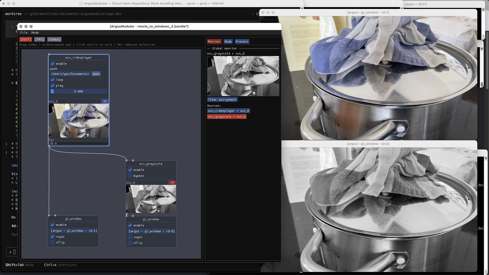

> **Note:** This is a read-only documentation mirror for **Argus Modular**.
> The full source code and active development happen in a private repository.

---

# argus-modular

Visual application for [argus-core](https://github.com/yacfish/argus-core): graph editor, bundles, live previews, and an always-on executor.

| Mode | What you get |
|------|----------------|
| **Operate** (default) | Graph ticks continuously; runtime controls, CPU previews, global monitor |
| **Edit** (`[EDIT]` menu) | Canvas wiring, floating node picker, Node tab inspector, undo/clipboard; executor keeps running |

Core owns graph logic, nodes, and the executor. This repo is **UI only** (Dear ImGui + GLFW).

## Screenshot



Node graph with live OpenCV video player, grayscale processing, and dual `gl_window` previews.


**Docs**

| Doc | Contents |
|-----|----------|
| [docs/roadmap.md](docs/roadmap.md) | What to build next |
| [docs/architecture.md](docs/architecture.md) | System map — **(done)** / **(soon)** / **(deferred)** |
| [docs/keyboard-shortcuts.md](docs/keyboard-shortcuts.md) | Keyboard cheat sheet |
| [docs/plan-live-topology.md](docs/plan-live-topology.md) | Live topology — shipped + remaining polish |
| [docs/plan-boundaries.md](docs/plan-boundaries.md) | SubgraphNode + CodeBox — B1–B5 done |
| [docs/plan-codebox-ux.md](docs/plan-codebox-ux.md) | CodeBox authoring spec (B4 — shipped) |
| [docs/codebox-lua-api.md](docs/codebox-lua-api.md) | CodeBox Lua API |
| [docs/plan-app-preferences.md](docs/plan-app-preferences.md) | Argus menu, prefs, File extensions |
| [docs/plan-graph-canvas-split.md](docs/plan-graph-canvas-split.md) | Canvas module split (shipped) |
| [docs/plan-gpu-pipeline.md](docs/plan-gpu-pipeline.md) | GPU path, `gl_viewer`, GLSL lib, external packs |
| [docs/argus-effect-format.md](docs/argus-effect-format.md) | External folder shader pack format (GP4) |
| [docs/ci-local.md](docs/ci-local.md) | Local smoke CI (`scripts/ci-local.sh`) |
| [docs/plan_initial.md](docs/plan_initial.md) | Bootstrap history (U1–U5) |

---

## Prerequisites

- CMake 3.25+, Ninja or Make, C++20 compiler
- OpenCV (same path as your argus-core build)
- argus-core — pinned in `cmake/resolve_argus_core.cmake` (`ARGUS_CORE_REF` = `f9ac20a…`, external shader pack discovery #62)

CMake resolves core in this order:

1. `-DARGUS_CORE_DIR=/path/to/argus-core` (local dev checkout)
2. git submodule `third_party/argus-core`
3. `$ENV{ARGUS_CORE_DIR}`
4. **FetchContent** from GitHub at `ARGUS_CORE_REF`

Fresh clone with no submodule fetches the pinned SHA automatically.

**Local dev** (sibling checkout):

```bash
cmake -S . -B build \
  -DCMAKE_BUILD_TYPE=Release \
  -DARGUS_CORE_DIR=/path/to/argus-core
cmake --build build -j
```

**When argus-core ships a fix you need:** bump `ARGUS_CORE_REF` in this repo in the same UI PR (or immediately after core merges). Cursor agents are instructed to do this without being asked — see [AGENTS.md](AGENTS.md).

```bash
./scripts/bump_argus_core_ref.sh -ud -m "short note" -cp   # merged on main: bump, docs, commit, push
./scripts/bump_argus_core_ref.sh -l -m "wip feature"        # local core only, pre-merge
```

---

## Build

**Always pass `-DCMAKE_BUILD_TYPE=Release`** (or `RelWithDebInfo`). A bare `cmake -S . -B build` leaves `CMAKE_BUILD_TYPE` empty on single-config generators (Ninja, Make) — the compiler runs with **no `-O` flags**. Media graphs then look ~10× slower than they should (e.g. ~2 fps instead of ~25 fps on a 1080p movie→OpenCV→GPU bundle) because per-pixel CPU work in this repo and linked core is unoptimized. OpenCV/ffmpeg decode can still look fine since those ship as optimized binaries.

```bash
cmake -S . -B build \
  -DCMAKE_BUILD_TYPE=Release \
  -DARGUS_CORE_DIR=/path/to/argus-core   # omit if using FetchContent pin
cmake --build build -j
```

After reconfiguring, confirm:

```bash
grep CMAKE_BUILD_TYPE build/CMakeCache.txt
# expect: CMAKE_BUILD_TYPE:STRING=Release
```

`Debug` is for stepping through UI code only; expect slow in-node previews on movie/GPU graphs (see `cmake/argus_core_debug_perf.cmake` — core nodes stay at `-O2` in Debug UI builds).

Interactive build flags (window nodes, OpenCV HighGUI/videoio) match a desktop app — see root `CMakeLists.txt`.

**Smoke CI** (all `argus_test_*_smoke` binaries, Release):

```bash
./scripts/ci-local.sh
```

See [docs/ci-local.md](docs/ci-local.md).

### Tick profiler (opt-in)

Per-node executor timing is available in **argus-core** when built with the current tree. Zero overhead when unset.

```bash
ARGUS_PROFILE_TICK=1 ./build/argus_ui --bundle /path/to/show.bundle
```

Once per second on **stderr**:

```
[tick-profile] ticks=27 avg_tick_ms=34.4
    OpenCVMoviePlayer: 6.88 ms/tick (1 calls/tick)
    CpuToGlesUpload: 6.81 ms/tick (1 calls/tick)
    ...
```

Use this when `ui_fps` ≈ `graph_fps` and you need to see which node type dominates tick time. Rebuild **both** ArgusModular and ArgusCore (`-DCMAKE_BUILD_TYPE=Release`) after changing profiler code.

---

## Run

```bash
./build/argus_ui
./build/argus_ui --bundle /path/to/show.bundle
```

Starts with an **empty document** if no bundle path is given. The executor **auto-starts** when a document is open. Use **File → Open bundle** or **Save as** for a new project.

Test fixture (from argus-core):

```
third_party/argus-core/examples/bundles/demo.bundle/
```

---

## Layout

```
src/
  app.*                  GLFW + ImGui lifecycle, [EDIT] toggle, executor poll
  graph_session.*        Graph, bundle I/O, presets, live topology wrappers
  signal_bridge.*        Core SignalBus → UI (params, previews)
  graph_canvas.*         Nodes, wires, picker, clipboard, undo
  boundary_authoring.*   Subgraph RAM embeds, save materialize, tab labels
  canvas_tabs.*          Subgraph tab bar registry + chrome
  subgraph_creation_panel.*  Embedded vs load-from-disk on new SubgraphNode
  edit_mode_panel.*      Side tabs: Monitor · Node · Presets
  preferences_panel.*    Preferences modal (Debug, UX remap)
  node_panel.*           Node tab inspector (params, previews, visibility)
  preview_view.*         CPU preview textures
  global_monitor_panel.* Full-size monitor tab
cmake/
  argus_link_builtin_nodes.cmake
docs/
  roadmap.md, architecture.md, plan-*.md
```

**Shell:** canvas left · side column right (Monitor / Node / Presets) · `[EDIT]` in menu bar · Debug in Preferences.

---

## Core docs (external)

| Topic | Location |
|-------|----------|
| UI design | argus-core `docs/internal/plan-graph-editor-ui.md` |
| Live topology (engine) | argus-core `docs/internal/plan-live-topology.md` |
| Bundles | argus-core `docs/internal/plan-app-bundle.md` |
| Local CI | argus-core `docs/ci-local.md` |

---

## License

| Component | License |
|-----------|---------|
| argus-core | See argus-core repo |
| Dear ImGui | MIT |
| GLFW | zlib/libpng-style |
| argus-modular | Your choice |