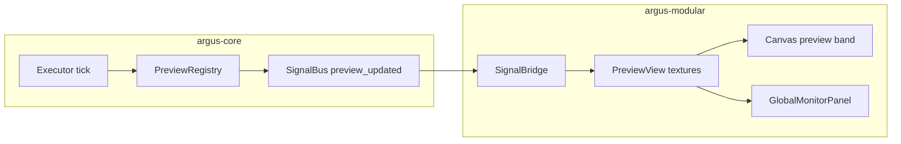

# Architecture — argus-modular

**Updated:** July 2026  
**Status:** Living map of the visual app. Planning lives in [roadmap.md](roadmap.md).

**Tags:** **(done)** shipped on `main` · **(soon)** active or next track · **(deferred)** explicit later / blocked

**Engine:** [argus-core](https://github.com/yacfish/argus-core) — graph, executor, nodes, bundles, signals. This repo is **UI only**.

---

## 1. Repository split

| Repo | Role | Tag |
|------|------|-----|
| **argus-core** | `Graph`, `Node`, executor, `GlesContext` / Vulkan, bundle I/O, `PreviewRegistry`, topology patch API | **(done)** |
| **argus-modular** (`argus_ui`) | Dear ImGui + GLFW shell, canvas editor, inspector, previews in-app | **(done)** |

CMake pins core via `cmake/resolve_argus_core.cmake` (`ARGUS_CORE_REF`, currently `f9ac20a…` — external shader pack discovery (#62)). UI links `argus_core` + `argus_builtin_nodes`.

**Pin maintenance:** After every argus-core change this app depends on, bump `ARGUS_CORE_REF` in the matching ArgusModular PR (agents: do this automatically — see [AGENTS.md](../AGENTS.md)). Script: `scripts/bump_argus_core_ref.sh` — post-merge use `-ud -m "note" -cp`; local pre-merge testing use `-l`.

---

## 2. Process & windows

```
GLFW window
  └── ImGui (desktop OpenGL) — full-screen root "Argus"
        ├── Menu bar: Argus · File · Mode · [EDIT] — Preferences **(done)** [plan-app-preferences.md](plan-app-preferences.md)
        ├── Graph canvas (custom draw list)
        └── Side column (300px): tabbed panels
```

| Piece | File(s) | Tag |
|-------|---------|-----|
| App lifecycle, menu, global shortcuts, dirty `*` title | `app.cpp` | **(done)** |
| Document session: graph, bundle, executor poll, presets | `graph_session.cpp` | **(done)** |
| Edit layout orchestration | `edit_mode_panel.cpp` | **(done)** |
| Optional `GlesWindowOutput` | core node — **separate** GLFW window | **(done)** |

---

## 3. Edit layout

**(done)** Current shell (UX-D):

- **Canvas left** — graph always visible when a document is open.
- **Side column right** — tabs: **Monitor**, **Node**, **Presets** (`SidePanelTab` in `edit_mode_panel.hpp`). Debug moves to **Preferences** — [plan-app-preferences.md](plan-app-preferences.md).
- **`[EDIT]`** — menu-bar toggle; red = enable edit, gray = disable edit (operate).

Executor **always running** while a document is open; `[EDIT]` is layout + interaction gating only — **(done)**. Remaining LT polish: `topology_changed` signal, fatal **Restart graph** — [plan-live-topology.md](plan-live-topology.md).

**(deferred)** Dockable ImGui panels, §2.0 shell polish — [roadmap.md](roadmap.md) untracked.

---

## 4. Node tab = inspector

There is **no separate inspector panel**. The **Node** side tab (`NodePanel` in `node_panel.cpp`) **is** the inspector:

| Responsibility | Tag |
|----------------|-----|
| All schema parameters (ignores `visible` for listing) | **(done)** |
| Parameter visibility toggles (`ui.params.*.visible`) for in-node canvas controls | **(done)** |
| Preview routing table: Source / Enable / Kind / channel | **(done)** |
| Node-level `preview_max_hz`, `preview_hover_only` | **(done)** |

**(deferred)** Rename node inline, multi-select batch params, explicit Apply button — [roadmap.md](roadmap.md) untracked.

**Link inspector** (wire selected, from → to) — **(deferred)**, not part of Node tab today.

---

## 5. Canvas editor

| Component | Role | Tag |
|-----------|------|-----|
| `GraphCanvas` + split modules | Nodes, wires, pan/zoom, selection, clipboard, undo — see [plan-graph-canvas-split.md](plan-graph-canvas-split.md) | **(done)** |
| `canvas_tabs` + `graph_canvas_tabs` | Subgraph tab bar, per-tab editor stash, **↓** / **×** chrome | **(done)** B2 |
| `boundary_authoring` | RAM embedded subgraphs; embedded script fork; save materialize; AssetRef path params | **(done)** B1–B4, AR1 |
| `asset_ref` / `asset_resolver` | Unified `{scope, path}`; legacy dual-read; preferences `search_paths` | **(done)** AR1 |
| `boundary_creation_panel` | Embedded vs load-from-disk on new `SubgraphNode` / `CodeBox` | **(done)** B1–B4 |
| `node_canvas_chrome.cpp` | In-node controls + preview band drawing | **(done)** |
| `FloatingNodePicker` | Catalog search; add (`⌘N`) or replace (double-click name) | **(done)** |
| `NodePalette` | Catalog data only (no side-panel palette UI) | **(done)** |
| `param_digit_drag.cpp` | Number scrub on canvas + inspector fields | **(done)** |

**(deferred)** Snap grid, type-mismatch wire hint, minimap, multi-select wires — [roadmap.md](roadmap.md).

---

## 6. Previews & monitor



| Piece | Role | Tag |
|-------|------|-----|
| `SignalBridge` | Keyed `(node_id, port\|inner)`; zero-copy `cv_mat` via shared `DataPtr`; generation dedup on ingest | **(done)** |
| `PreviewView` | CPU RGB upload → ImGui texture (skip re-upload when generation unchanged); viewer variants | **(done)** |
| Canvas **GM** button | Assign single global monitor while disable edit | **(done)** |
| `gl_texture` / `gl_viewer` | GPU outlet previews in graph | **(done)** GPU pipeline GP2 |
| Zero-copy GLES blit to ImGui | Same GL context as graph | **(deferred)** |

**Two display paths (complementary):**

| Path | Use | Tag |
|------|-----|-----|
| In-app `ui.previews` | Authoring thumbnails + Monitor tab | **(done)** CPU + GPU (`gl_viewer`) |
| `GlesWindowOutput` / sinks | Production fullscreen / multi-monitor | **(done)** |

---

## 7. Modes & transport

| Today | Target | Tag |
|-------|--------|-----|
| Always-on executor; `[EDIT]` toggle separate | Same | **(done)** |
| Disable edit: canvas + side tabs; Presets live; Node grayed | Same | **(done)** |
| Enable edit: wiring, picker, Node tab interactive | Same | **(done)** |
| `set_parameter` live while running | Same | **(done)** |
| Interactive topology (add/wire/delete/hot-swap) | Live patch primitives while ticking | **(done)** |
| Undo fallback / large reload | `apply_graph_json` (brief internal stop) | **(done)** |
| `topology_changed` → canvas resync | SignalBridge subscription | **(soon)** LT-UI-4 |

---

## 8. Bundles & persistence

| Piece | Tag |
|-------|-----|
| Folder bundle open/save/save-as (`bundle_picker.cpp`) | **(done)** |
| Empty document startup | **(done)** |
| Graph JSON + `ui` blocks in editor snapshot | **(done)** |
| Presets tab (load/save named presets in bundle) | **(done)** |
| Subgraph `graphs/*.json` + CodeBox `scripts/*.lua` (materialized on save); Inlet/Outlet inner authoring; parent **↑** exposure | **(done)** B1–B5 — [plan-boundaries.md](plan-boundaries.md) |
| App preferences (`preferences.json`, user config dir) | **(done)** [plan-app-preferences.md](plan-app-preferences.md) |
| Recent bundles, templates, reload from disk | **(done)** File menu |
| Auto-save `.autosave/` | **(deferred)** |
| Timeline `timelines/` | **(deferred)** roadmap #15 |

---

## 9. GPU & shader path

| Piece | Tag |
|-------|-----|
| Core GLES nodes (`GlesShaderModule`, upload/download/window) | **(done)** in core |
| UI catalog lists GPU types; `ARGUS_UI_HAS_GLES3` gating | **(done)** |
| **One** UI GPU path: GL (chosen on dev host) | **(done)** GPU pipeline GP1 |
| `gl_viewer` GPU previews | **(done)** GPU pipeline GP2 |
| Built-in GLSL shader lib + `glsl_*` palette (`GlslShader`) | **(done)** GPU pipeline GP3 + GP3.2 (PR #49) |
| External folder shader packs (runtime → palette) | **(done)** GPU pipeline GP4 runtime — [argus-effect-format.md](argus-effect-format.md) |
| GP5 local CI (`scripts/ci-local.sh`) | **(done)** — [ci-local.md](ci-local.md) |
| GP4 follow-ups (color params, bundle zip) | **(soon)** [plan-gpu-pipeline.md](plan-gpu-pipeline.md) · [plan-jxs-import.md](plan-jxs-import.md) J1–J4.1 |
| GitHub Actions CI | **(deferred)** when minutes available |
| Vulkan / Metal primary path | **(deferred)** unless F1 picks them |
| `GlesComputeModule` / ES 3.1 compute in UI | **(deferred)** Linux EGL |

---

## 10. Modular boundaries

| Node | Bundle file param | UI workflow | Tag |
|------|-------------------|-------------|-----|
| `SubgraphNode` | `subgraph` AssetRef (`bundle` embedded / `external` disk); legacy `subgraph_file` / `bundle_ref` on load | Canvas tabs; title-bar **↓**; AssetRef widget; parent **↑** exposure | **(done)** B1–B5, AR1 — [plan-boundaries.md](plan-boundaries.md) · [plan-asset-ref.md](plan-asset-ref.md) |
| `CodeBox` | `script` AssetRef (`bundle` embedded / `external` disk); legacy `script` / `script_ref` on load | Shared creation panel; script `inlets`/`outlets`/`ui`; external editor; inner previews + buttons — [plan-codebox-ux.md](plan-codebox-ux.md) | **(done)** B4, AR1 |

---

## 11. Keyboard & help

| Piece | Tag |
|-------|-----|
| `keyboard_shortcuts.hpp` — chords via `ImGuiMod_Ctrl` + macOS behaviors | **(done)** |
| [keyboard-shortcuts.md](keyboard-shortcuts.md) — cheat sheet | **(done)** |
| `⌘⇧V` paste replace | **(deferred)** |

---

## 12. Palette tiers (catalog-driven)

All types come from `NodeFactoryRegistry::node_catalog_json()`. Floating picker (`⌘N`) is the add UI.

| Tier | Examples | Tag |
|------|----------|-----|
| **P0** CPU vision + `SubgraphNode` + `CodeBox` | loader, movie, camera, processor, passthrough | **(done)** B1–B5 — [plan-boundaries.md](plan-boundaries.md) |
| **P1** GPU | `CpuToGlesUpload`, `GlesWindowOutput`, `GlesShaderModule` *(dev)*, **`GlslShader` + `glsl_*` lib** *(GP3)* | **(done)** [plan-gpu-pipeline.md](plan-gpu-pipeline.md) |
| **P2** Analysis / I/O | `BlobDetector`, `Sketch2D`, recorder, … | **(deferred)** workflows |
| **P3** | Vulkan nodes, `GlesComputeModule`, `Inlet`/`Outlet` (subgraph only) | **(deferred)** / build-gated |

---

## 13. Supporting systems

| System | File(s) | Tag |
|--------|---------|-----|
| Clipboard `argus-subgraph-v1` | `graph_clipboard.cpp` | **(done)** |
| Undo/redo (canvas topology) | `editor_undo_stack.cpp` | **(done)** |
| Bypass visibility rules | `control_visibility.cpp`, [plan-bypass-eligibility.md](plan-bypass-eligibility.md) | **(done)** |
| Debug prefs (Preferences → Debug) + FPS logging | `editor_log.cpp`, `preferences_panel.cpp` | **(done)** |
| Media-graph perf (Release build, palette cache, preview throttle, tick profiler) | `node_palette.*`, `graph_session.*`, README, AGENTS.md; core `ARGUS_PROFILE_TICK` | **(done)** |
| App CI smoke | `scripts/ci-local.sh` | **(done)** · [ci-local.md](ci-local.md) |

---

## 14. Doc map

| Doc | Purpose |
|-----|---------|
| [roadmap.md](roadmap.md) | **Single planning doc** — tracked #8–15, deferred, untracked backlog |
| [architecture.md](architecture.md) | This file — system map + tags |
| [plan-boundaries.md](plan-boundaries.md) | SubgraphNode + CodeBox feature track (B1–B5) |
| [plan-asset-ref.md](plan-asset-ref.md) | Unified `AssetRef` path params (AR1 — **shipped** on `main`) |
| [plan-codebox-ux.md](plan-codebox-ux.md) | CodeBox authoring UX (B4) |
| [codebox-lua-api.md](codebox-lua-api.md) | CodeBox Lua API (first iteration) |
| [plan-app-preferences.md](plan-app-preferences.md) | Argus menu, prefs modal, File extensions |
| [plan-graph-canvas-split.md](plan-graph-canvas-split.md) | Graph canvas module split (shipped) |
| [plan-gpu-pipeline.md](plan-gpu-pipeline.md) | GPU path, `gl_viewer`, GLSL lib, external packs, CI |
| [plan-parameter-types.md](plan-parameter-types.md) | `int` / `vec2` / `vec3` / `vec4` parameters — **(done)** |
| [plan-parameter-widgets.md](plan-parameter-widgets.md) | Widget registry; CodeBox `ui` types (`vec2`, `enum`, `int`/`float`, colors); preview viewers — **(deferred)** |
| [plan-color-parameters.md](plan-color-parameters.md) | `color_rgb` / `color_rgba` + picker — **(soon)** |
| [plan-jxs-import.md](plan-jxs-import.md) | JXS → GP4 pack import script — **(done)** core #69 |
| [argus-effect-format.md](argus-effect-format.md) | External folder shader pack format (GP4) |
| [ci-local.md](ci-local.md) | Local smoke CI (`scripts/ci-local.sh`) |
| [plan-ui-ux.md](plan-ui-ux.md) | **Closed** — superseded June 2026 |
| `next_on_UX-*.md` | Historical UX-A–D acceptance detail (editor polish) |
| [plan-live-topology.md](plan-live-topology.md) | LT-UI consumption of core patch API |
| [plan_initial.md](plan_initial.md) | Bootstrap U1–U5 history |

---

*Core design reference: [plan-graph-editor-ui.md](https://github.com/yacfish/argus-core/blob/main/docs/internal/plan-graph-editor-ui.md)*