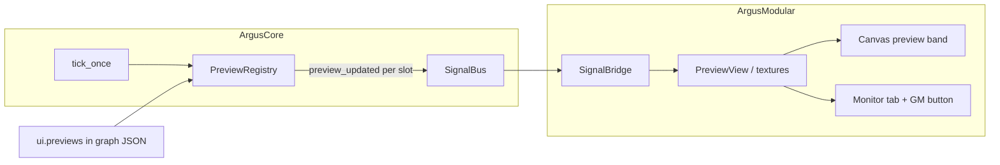

# UX-A #4 — Live previews + global monitor

**Merged:** [#16](https://github.com/yacfish/argus-modular/pull/16) → `main` (2026-06-17; follows merged #15)  
**Prerequisite:** UX-A #3 merged (picker, in-canvas controls, preview slot authoring).  
**Design reference:** [plan-ui-ux.md](plan-ui-ux.md) §2.3

**Status:** **Done** — 4a through 4d-ui on `main`.

---

## Goal

Wire **in-app** preview for authoring: canvas node bands + **Monitor** side-tab global monitor, driven by `ui.previews[]` and core `PreviewRegistry` / `preview_updated`. Drop the legacy hardcoded `ocv_imageloader.out` path.

**Not a replacement for output windows.** `gl_window` remains a **first-class production sink** — fullscreen 4K, projectors, many displays, tens of channels on separate outputs. In-app preview is for editing and glancing inside the small editor shell; external windows are how results go to real-world screens at scale.

---

## Architecture

| Layer | Status |
|-------|--------|
| `PreviewRegistry` samples port slots at `max_hz` | **Done** (core) |
| `PreviewRegistry` samples `source: inner` slots (`fps`) | **Done** (4d-core) |
| `GraphSession::refresh_preview_registry()` on load / topology / editor sync | **Done** |
| `SignalBridge` keyed `(node_id, port_name \| inner_key)` + `peek_preview` (`shared_ptr`, zero-copy RGB8) | **Done** |
| Frame pump after `poll_executor()` | **Done** |
| Node tab preview routing table | **Done** |
| In-node live textures + viewer variants | **Done** (4b, 4d-ui) |
| Global monitor + canvas **GM** button | **Done** (4c) |

---

## Node tab — preview routing

Single flat table per selected node (no sections, no Add/Remove):

| Column | Control | JSON |
|--------|---------|------|
| **Source** | Read-only | `out_0`, `out_1`, … (display label); wire name in `port` or inner key in `inner` |
| **Enable** | `off` / `node` / `global` / `both` | `display` (row omitted when `off`) |
| **Kind** | Viewer dropdown | `viewer` (filtered by inferred signal `kind`) |
| *(inline)* | Channel combo when Kind = `image_channels` | `channel` (`r`/`g`/`b`/`a`/`luma`, default `r`) |

**Node-level settings** (above table):

| Field | JSON | Purpose |
|-------|------|---------|
| Max Hz | `ui.preview_max_hz` | Throttle for **all** enabled slots on this node (copied into each slot’s `max_hz` on sync) |
| Hover only | `ui.preview_hover_only` | Mute registry + pump until canvas node is hovered |

Signal `kind` (`cv_mat`, `numbers`, …) is **inferred** from port `DataType` or inner feed definition — not a user column.

**Inner rows** (same table): e.g. `fps` on `OpenCVMoviePlayer` / `OpenCVCamera`.

### Viewers by signal kind

| `kind` | `viewer` options |
|--------|------------------|
| `cv_mat` | `image_square`, `image_4x3`, `image_16x9`, `image_auto`, `image_channels`, `image_rgba_wide` |
| `numbers` | `text`, `sparkline` |
| `gl_texture` | `image` (legacy alias → square path TBD for zero-copy) |
| other | `text` |

Legacy `image` → `image_square`; `image_custom` → `image_auto`.

---

## Display routing (Enable column)

| Enable | On canvas | Monitor tab | JSON `display` |
|--------|-----------|-------------|----------------|
| **off** | — | — | (row omitted) |
| **node** | Source label + preview body | — | `in_node` |
| **global** | Source label + **GM** (no preview body) | Eligible for assignment | `global_monitor` |
| **both** | Label + preview body + **GM** | Eligible | `both` |

---

## Global monitor + **GM** button

- **Monitor** side tab (right column): large viewer for the assigned source + scrollable assign list.
- Canvas **GM** button on monitor-eligible slots when **edit is off** (blue = unassigned, red = active).
- **One assignment app-wide.** Clicking red **GM** or a red source in the Monitor list **clears** the assignment (toggle off).
- Assigning from canvas **GM** opens the **Monitor** tab if hidden or on Node/Presets; clearing does not change the open tab.
- No effect while **edit is on** (GM disabled) — routing is configured in the Node tab.

---

## Implementation slices (all done)

### 4a — Foundation

Keyed `SignalBridge`, frame pump, routing table, `preview_max_hz`, `preview_hover_only`, canvas hover muting.

### 4d-core — Inner FPS

Rolling frame timestamps on movie player + camera; `source: inner` + `inner: fps` → `kind: numbers` / `ScalarF32`; sparkline ring buffer on pump.

### 4b — In-node live image

`PreviewView` textures in canvas preview band; letterboxed contain-fit; source labels on every row; default `image_square`.

### 4c — Global monitor + GM

`GlobalMonitorPanel`, `GlobalMonitorSlot` on `GraphSession`, canvas GM widgets, global-only label row without preview body.

### 4d-ui — Viewer variants

| Viewer | Behavior |
|--------|----------|
| `image_auto` | Band aspect from live frame |
| `image_channels` | Single-channel grayscale; `channel` in JSON |
| `image_rgba_wide` | R‖G‖B‖A vertical strips; band aspect = 4× source |
| `text` / `sparkline` | Numbers feeds (e.g. inner `fps`) |

---

## Deferred (post–#4)

| Item | Notes |
|------|-------|
| **More inner feeds** | Only `fps` on movie/camera today |
| **`gl_texture` zero-copy** | CPU `cv_mat` upload path only; GLES blit stretch |
| **`topology_changed` in SignalBridge** | UX-A later or live-topology LT-UI |
| **`parameter_changed` UI** | Optional debug strip or drop |
| **JSON/multiline param editors** | No node needs object params yet |

---

## Two display paths (complementary)

| Path | Role | Scale |
|------|------|-------|
| **In-app** (`ui.previews`) | Authoring: thumbnails on canvas, one global monitor slot | Editor window |
| **Output sinks** (`gl_window`) | Production: fullscreen, multi-monitor | Many dedicated OS windows |

### Sink notes

- **`ocv_window`** — removed from palette; replace with `gl_window` manually in saved bundles (swap node `type`, prune broken connections).
- **`gl_window`** — per-node GLFW windows (core `0d3f456+`); auto window title (core `76b94dd`). Legacy `title` param stripped from graph JSON on apply.

---

## Test plan

- [x] Two nodes with previews → each slot keyed correctly
- [x] `ui.previews` on loader / movie player → in-node band shows live image
- [x] Movie player `fps` inner row → text and sparkline update
- [x] GM assigns global monitor; only one red at a time; toggle off from GM or Monitor list
- [x] GM assign opens Monitor tab; GM clear leaves tab unchanged
- [x] Enable **global** only → label + GM on canvas, no preview body
- [x] `image_channels` / `image_rgba_wide` on CPU RGB/RGBA
- [x] Hover only: previews mute until node hovered
- [x] Save/reload bundle preserves `ui.previews`
- [x] Graph with sinks + `ui.previews` — both paths work