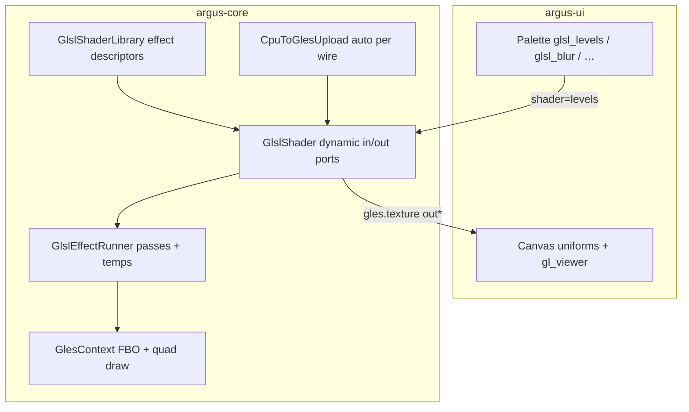

# GPU pipeline — pixel shaders in the loop

**Track:** GPU backend + in-graph previews + **built-in GLSL effects** (not a UX polish phase)  
**Branch:** `gpu-pipeline` (or equivalent) off `main`  
**Prerequisites:** [plan-boundaries.md](plan-boundaries.md) B4 on `main` (B5 optional); [plan-asset-ref.md](plan-asset-ref.md) AR1 — **shipped** on `main`  
**Core design:** [argus-core plan-opengl-es3.md](https://github.com/yacfish/argus-core/blob/main/docs/internal/plan-opengl-es3.md), [plan-strategic-direction.md](https://github.com/yacfish/argus-core/blob/main/docs/internal/plan-strategic-direction.md), [plan-signal-preview.md](https://github.com/yacfish/argus-core/blob/main/docs/internal/plan-signal-preview.md) (P3 `gl_texture` readback)

---

## Goal

**GP1:** choose exactly one of **GL**, **VLK**, or **MTL** for pixel shaders in the executor loop.  
**GP2:** in-graph GPU previews (`gl_viewer`) on the chosen path.  
**GP3:** **built-in GLSL shader library** exposed as first-class palette nodes (`glsl_<name>`), not ad-hoc file-backed `GlesShaderModule` graphs.

**Acceptance loop (GL path — product shape):**

```
OpenCVMoviePlayer / OpenCVImageLoader
  → [CPU processing / subgraph — optional]
  → glsl_<effect>                 # implicit cpu.rgb8 → gles.texture upload at wire time
  → GlesWindowOutput
  and/or gles.texture outlet → gl_viewer (in-node + Monitor)
```

User picks **`glsl_levels`** (etc.) from the floating palette, wires movie → effect → window, tweaks exposed uniforms live, saves bundle, reopens — **without** hand-editing JSON or dropping in a generic shader node with a fragment path.

---

## Strategic direction (2026-03)

| Layer | Role |
|-------|------|
| **`GlesShaderModule`** | **Spike / dev tool** — proved GLES draw + live params + bundle `fragment_shader` paths. Stays in core; **not** the primary editor workflow. |
| **Built-in shader lib** | **Product** — curated GLSL sources compiled into the binary (or embedded at build time), uniform schema, stable IDs. |
| **`GlslShader` executor node** | Thin wrapper: one node type, `shader` param selects lib entry; shared GLES fullscreen-quad path. |
| **Palette `glsl_<name>`** | UI expands the lib registry (same pattern as `OpenCVProcessor` × `operation`). Each entry is a named effect users actually add. |
| **GP4 (file shaders)** | Still useful later for experiments and power users; not the main integrated path. |

**Validated manually (no separate milestone):** implicit `cpu.rgb8` → `gles.texture` via auto-inserted `CpuToGlesUpload` (`__auto_conv_*`, collapsed in saved JSON); movie → subgraph → shader → window bundles; `gl_viewer` on CPU and GPU preview slots.

---

## Scope overview

| Step | Name | Priority | Status |
|------|------|----------|--------|
| **GP1** | Select GPU path — **GL** vs **VLK** vs **MTL** | P0 — gate | **Done** — **GL** on macOS 12 dev host |
| **GP2** | `gl_viewer` — in-graph GPU previews | P0 | **Shipped** (PR #44) |
| **GP3** | **GLSL shader lib + `glsl_*` palette nodes** | P0 | **Shipped** on `main` (PR #47, #49) |
| **GP3.2** | **Tier 2 shader catalog** (`hue_shift`, `threshold`, `vignette`, `sharpen`, `color_tint`) | P0 | **Shipped** on `main` (PR #49, core #59) |
| **GP4** | External shader packs + dev tooling | P2 | **Runtime shipped** — JXS import J1–J4.1; color / zip remain |
| **GP5** | CI + platform matrix | P1 | **Shipped** (local CI); GitHub Actions **deferred** |

---

## GP1 — Select GPU path: GL vs VLK vs MTL (P0)

**Deliverable:** a **recorded choice** of exactly one backend, then CMake + palette locked to that path. The UI does **not** ship three parallel shader stacks.

### GP1 decision

| Chosen | CMake (UI) | `ARGUS_UI_HAS_*` | Palette | Notes |
|--------|------------|------------------|---------|-------|
| **GL** ✅ | `GLES3=ON`, `VULKAN=OFF` | `HAS_GLES3=1`, `HAS_VULKAN=0` | Grey VLK nodes | macOS 12 desktop GL 3.3; only path with working shaders + `gl_texture` readback on dev machine |

VLK / MTL remain documented for future hosts; they are **out of scope** for GP3.

### The three candidates (reference)

| Code | API | Core types | Shader node (spike) | Window / display | Texture in graph |
|------|-----|------------|---------------------|------------------|------------------|
| **GL** | OpenGL ES 3.x (EGL / ANGLE / desktop GL fallback) | `gles.texture` | `GlesShaderModule` *(dev)* → **`GlslShader`** *(product)* | `GlesWindowOutput` | implicit / `CpuToGlesUpload` / `GlesToCpuDownload` |
| **VLK** | Vulkan (+ MoltenVK on Mac) | `vulkan.image` | `SimpleShaderModule` | `VulkanWindowOutput` | Vulkan upload/download converters |
| **MTL** | Metal (native Apple) | `metal.texture` *(planned)* | *(none)* | *(none)* | *(none)* |

**Status:** **Done** — GL chosen; spikes on dev Mac satisfied by existing GLES graphs and editor sessions.

---

## GP2 — `gl_viewer` for in-graph viewers (P0)

**Deliverable:** GPU texture preview slots render live output **inside the node band** and on the **Monitor** tab — without a CPU download node in the graph.

| Item | Notes |
|------|--------|
| Viewer kind | **`gl_viewer`** — default for `signal_kind == "gl_texture"` |
| SignalBridge | `event.kind == "gl_texture"` → `PreviewView` |
| Canvas + Monitor | [node_canvas_chrome.cpp](../src/node_canvas_chrome.cpp), [global_monitor_panel.cpp](../src/global_monitor_panel.cpp) |
| JSON | `ui.previews[].viewer: "gl_viewer"`; migrate legacy `image` on GPU slots |

**Not GP2:** zero-copy blit of live `GLuint` into ImGui.

**Status:** **Shipped** on `main` (merged PR #44).

---

## GP3 — GLSL shader library + palette nodes (P0) — **shipped** (`gpu-pipeline`)

**Deliverable:** a **versioned, built-in shader library** in argus-core and **one palette entry per effect** (`glsl_<name>`), wired through a single executor node type.

**Status (2026-07):** **Shipped** on `main` — core GP3.0 runner + GP3.1 Tier-1 catalog + GP3.2 Tier-2 effects; UI palette expansion + `gl_viewer` on `GlslShader` outputs. `GlesShaderModule` file-backed graphs remain supported.

**Naming:**

| Surface | Convention | Example |
|---------|------------|---------|
| Palette label + default graph name | `glsl_<id>` | `glsl_levels` |
| Lib registry `id` | short snake_case (no prefix) | `levels` |
| Executor `type` | `GlslShader` | `"type": "GlslShader"` |
| Saved `params.shader` | registry `id` | `"shader": "levels"` |

### Why not `GlesShaderModule` as the main node?

`GlesShaderModule` couples rendering to a **bundle file path** (`fragment_shader`) and hard-coded uniforms (`brightness`, `contrast`, `invert`). That was enough to validate GLES in the loop, but it does not give:

- Stable palette names and categories
- Uniform schema driven by the lib (slider ranges, visibility, canvas exposure)
- Effects shipped with the app (no missing `.frag` on reload)
- A path to grow a curated catalog without JSON surgery

GP3 replaces the **user-facing** shader story; `GlesShaderModule` remains for GP4 experiments.

### Architecture



### GP3.0 — Effect runner foundation (build first)

**Yes — add multi-pass / multi-in / multi-out before the full shader catalog.** Tier 1 effects are single-pass instances of the same descriptor format; blur, blend, and chroma-style effects then become lib entries, not new executor architectures.

**Prerequisite in core today (already exists):**

- `GlesContext::create_fbo_with_color_attachment` — render-to-texture
- `GlesShaderModule::process()` — fullscreen quad → FBO (extract, do not duplicate per effect)
- `OpenCVAdd` — two media inlets (hot + cold); pattern for multi-in sync
- `ConversionRegistry` — auto `CpuToGlesUpload` **per incompatible wire** (each inlet can come from CPU independently)

#### `GlslEffect` descriptor (one schema for all effects)

Every lib entry — including Tier 1 — is a descriptor, not bespoke C++ per shader.

| Field | Purpose |
|-------|---------|
| `id`, `display_name`, `category` | Registry + palette `glsl_<id>` |
| `inputs[]` | Graph-facing inlets: `name`, `type` (`gles.texture`), `role` (`hot` / `cold`) |
| `outputs[]` | Graph-facing outlets: `name`, `type` |
| `uniforms[]` | User params (float/bool/vec3…), bound every pass |
| `passes[]` | Ordered draw steps (see below) |
| `temps[]` | Optional named internal targets (not graph ports) |

**Pass entry:**

| Field | Purpose |
|-------|---------|
| `fragment` | Built-in source id or embedded GLSL |
| `samplers` | Map `uniform_name` → `{ input: "a" }` or `{ temp: "t0" }` |
| `target` | `{ output: "out" }` or `{ temp: "t0" }` |
| `size_from` | Which input sets W×H (default: primary input `inputs[0]`) |

**Execution (`GlslEffectRunner`):**

1. Resolve input textures from wired ports; derive width/height from `size_from`.
2. Allocate / reuse **internal temp FBOs** (`t0`, `t1`, …) and per-output FBOs at that size.
3. For each pass: bind target FBO, bind samplers to texture units, set uniforms, draw quad.
4. Publish each graph `output` from its final texture (wrap as `GlesTexture`).

Temps are **node-private** (like `GlesShaderModule`’s `output_target_` today) — never appear in saved graph JSON.


#### `GlslShader` node (executor)

| Item | Notes |
|------|--------|
| **Dynamic ports** | On `initialize(params.shader)`: add N inputs + M outputs from descriptor (CodeBox / SubgraphNode precedent). |
| **Reactive setup** | `setup_reactive_media_in` on primary hot inlet; additional hot inlets per lib metadata; cold inlets for optional/static second source. |
| **Program cache** | Key `(effect_id, pass_index, backend_variant)`; shared vertex shader. |
| **Bypass** | Relay primary hot inlet to primary output when types allow (existing bypass rules). |

#### UI follow-ups (same milestone)

| Item | Notes |
|------|--------|
| **Multi-inlet chrome** | Canvas draws N input pins from node `ports` JSON (already generic). |
| **Multi-outlet previews** | Seed `gl_viewer` per output port; preview slots already have `port` field. |
| **Palette** | Still one `GlslShader` type; unchanged. |

#### GP3.0 acceptance (before Tier 1 catalog)

| Proof effect | In | Out | Passes | Proves |
|--------------|----|-----|--------|--------|
| `passthrough` | 1 | 1 | 1 | Runner + dynamic 1×1 ports |
| `blur` | 1 | 1 | 2 | Internal temp ping-pong |
| `blend` | 2 (`base`, `overlay`) | 1 | 1 | Two samplers, two wires |
| *(optional)* `chroma_key` | 1 | 2 (`out`, `matte`) | 2 | Multi-out + multi-pass |

**Gate:** all four descriptor features exercised by at least one shipped proof effect (minimum: passthrough + blur + blend).

### Core (argus-core) — GP3.1 catalog work

| Item | Notes |
|------|--------|
| **`GlslShaderLibrary`** | Registry of `GlslEffect` descriptors + embedded GLSL sources (desktop + ES variants). |
| **Built-in sources** | See [First shader catalog](#first-shader-catalog). Tier 1 = single-pass descriptors. |
| **`GlslShader` node** | Thin shell around library + runner (no per-effect C++). |
| **Factory + catalog** | Register `GlslShader`; `wants_gles_context`. |
| **Conversion** | Unchanged — per-wire auto upload. |

**Persistence:** `"type": "GlslShader", "params": { "shader": "levels", …uniforms }`.

### UI (argus-modular) — new work

| Item | Notes |
|------|--------|
| **Palette expansion** | Like [node_palette.cpp](../src/node_palette.cpp) `append_opencv_processor_entries`: for each lib entry, push `PaletteEntry` with `type = "GlslShader"`, `default_params.shader = <id>`, `display_name = "glsl_<id>"`, category **GLSL** (under GPU). |
| **Defaults + naming** | [node_defaults.cpp](../src/node_defaults.cpp): graph name `glsl_<id>`, default uniform values from lib schema. |
| **Param UI** | Map lib uniform schema → canvas widgets (float/slider/toggle); optional `ui.params` overrides per effect later. |
| **Previews** | Seed `gl_viewer` on `out` for new nodes (GP2). |
| **Demote `GlesShaderModule`** | **Dev** palette category; file picker + inline compile errors; enable **gles** tag in Preferences → Debug for console mirror | **(done)** |

### First shader catalog

All entries use the **same `GlslEffect` descriptor**; Tier 1 happens to be 1-in / 1-out / 1-pass. Tier 2–3 add passes or ports without executor changes.

#### Tier 1 — ship after GP3.0 gate (single-pass)

| `id` | Palette | Uniforms (v1) | Notes |
|------|---------|---------------|-------|
| `passthrough` | `glsl_passthrough` | — | Also GP3.0 proof effect |
| `levels` | `glsl_levels` | `brightness`, `contrast`, `gamma` | Port of `GlesShaderModule` default |
| `invert` | `glsl_invert` | — | `1.0 - rgb` |
| `saturation` | `glsl_saturation` | `amount` | Luma-preserving |
| `grayscale` | `glsl_grayscale` | `mix` | Color → B&W |
| `gamma` | `glsl_gamma` | `gamma` | Standalone gamma |

**GP3.1 gate:** Tier 1 registered + palette visible.

#### Tier 2 — multi-pass / multi-in (foundation unlocked)

| `id` | Palette | In | Out | Passes | Notes |
|------|---------|----|-----|--------|-------|
| `blur` | `glsl_blur` | 1 | 1 | 2 | Separable Gaussian; GP3.0 proof — **shipped** |
| `blend` | `glsl_blend` | 2 | 1 | 1 | `mode`, `opacity`; GP3.0 proof — **shipped** |
| `hue_shift` | `glsl_hue_shift` | 1 | 1 | 1 | HSV hue rotate — **GP3.2** |
| `threshold` | `glsl_threshold` | 1 | 1 | 1 | Soft luma mask — **GP3.2** |
| `vignette` | `glsl_vignette` | 1 | 1 | 1 | Radial darken — **GP3.2** |
| `sharpen` | `glsl_sharpen` | 1 | 1 | 1 | 3×3 unsharp — **GP3.2** |
| `color_tint` | `glsl_color_tint` | 1 | 1 | 1 | Tint multiply — **GP3.2** |

#### Tier 3 — richer graphs on same runner

| `id` | In | Out | Passes | Notes |
|------|----|-----|--------|-------|
| `chroma_key` | 1 | 2 (`out`, `matte`) | 2 | Key + spill pass; optional 2nd proof in GP3.0 |
| `lut` | 1 | 1 | 1+ | Needs **LUT texture asset** (GP4 asset path); sampler from bundled 2D/3D LUT |
| `dual_blur` | 1 | 2 | 2+ | Example multi-out blur (raw + blurred) if useful |

**Not in catalog:** crop/resize/mirror (OpenCV / subgraph); file-backed fragments → GP4.

### GP3 acceptance

- [x] **GP3.0:** `passthrough` + `blur` (2-pass) + `blend` (2-in) run in editor with `gl_viewer`
- [x] **GP3.1:** Tier 1 palette entries (`glsl_levels`, `glsl_blur`, `glsl_blend`, …) visible in floating picker
- [x] Implicit upload per wire; no `CpuToGlesUpload` in saved JSON
- [x] Live uniforms; save/reload stable
- [x] `GlesShaderModule` bundles still load

### Out of GP3

- User-authored fragment files (GP4)
- Compute shaders / `GlesComputeModule`
- VLK / MTL shader libs

**Status:** **Shipped** on `gpu-pipeline` — see [Media graph performance](#media-graph-performance-2026-07) for build/profiler notes.

---

## Media graph performance (2026-07)

Heavy CPU/GPU graphs (1080p movie → OpenCV subgraph → `CpuToGlesUpload` → shader → `GlesWindowOutput`) are sensitive to **build flags** and **preview cost**.

| Topic | Detail |
|-------|--------|
| **Release builds** | Always `-DCMAKE_BUILD_TYPE=Release` (or `RelWithDebInfo`). Empty `CMAKE_BUILD_TYPE` on Ninja/Make → no `-O` → ~10× slower per-pixel work (~2 fps vs ~25 fps on dev Mac). See [README.md](../README.md) § Build. |
| **Debug UI** | `cmake/argus_core_debug_perf.cmake` keeps core nodes at `-O2` when UI is Debug; still slower than full Release. |
| **Tick profiler** | `ARGUS_PROFILE_TICK=1` — per-node `ms/tick` on stderr (argus-core `Executor`). Use when `ui_fps` ≈ `graph_fps`. |
| **UI perf fixes** (`gpu-pipeline`) | Palette catalog cache; inner-subgraph preview throttle routing; GLES bind only when context active; `measure_node_chrome` per-frame cache; host-embedded `GlesWindowOutput` disables vsync. |
| **Core perf fixes** (`feature/glsl-shader-pr3` / pin bump) | Catalog JSON static cache; skip redundant `glfwMakeContextCurrent`; subgraph inner-preview gating; `PreviewRegistry::has_active_samples()`. |

**Not a GP3 regression:** GP3 commits add new `GlslShader` nodes only; existing `GlesShaderModule` + OpenCV hot paths are unchanged by the GP3 feature diff. Apparent “GP3 slowdown” on media graphs was traced to an unoptimized UI build (2026-07).

---

## GP4 — External shader packs + dev tooling (P2) — **runtime shipped**

Optional power-user path: **folder packs** (`ref.json` + `vertex.glsl` + `fragment.glsl`) and legacy **`GlesShaderModule`** file `.frag` graphs.

| Item | Notes | Status |
|------|--------|--------|
| **Folder pack format** | One dir per effect; folder name = canonical id | **Shipped** — [argus-effect-format.md](argus-effect-format.md) |
| **Runtime load** | Exe `shaders/packs/`, preferences **search paths**, cwd walk → `GlslShaderLibrary` | **Shipped** (core #61 + #62, modular #50) |
| **Palette expand** | External ids → `glsl_<id>` like built-ins | **Shipped** |
| JXS → pack import script | Emit folder layout from Max/Jitter `.jxs` | **(done)** J1–J4.1 — [plan-jxs-import.md](plan-jxs-import.md) |
| `vec2` / `vec3` / `vec4` / `int` effect params | Core + UI parameter types | **(done)** — [plan-parameter-types.md](plan-parameter-types.md) |
| `color_rgb` / `color_rgba` + picker | Semantic color types | Not started — [plan-color-parameters.md](plan-color-parameters.md) |
| `GlesShaderModule` UX | File picker, compile errors in inspector + **gles** debug tag (Preferences) | **(done)** |
| Bundle / zip packs | Same layout inside archive | **Deferred** |

**Status:** Runtime folder packs on `main`; palette auto-expands like GP3. No terminal env vars required for normal use.

---

## GP5 — CI + platform matrix (P1) — **shipped** (local)

| Item | Notes | Status |
|------|--------|--------|
| App smoke CI | `scripts/ci-local.sh` — Release build + all `*_smoke` binaries | **Shipped** (modular #50) |
| Headless GLES graph | Core `argus_test_gles_nodes` / `argus_test_glsl_effect_runner` | **Shipped** — core `ci-local.sh` |
| Shader lib smoke | `argus_test_glsl_shader_library` + `argus_test_glsl_effect_runner` | **Shipped** |
| External pack smoke | `glsl_demo_invert` in palette (`argus_test_boundary_authoring_smoke`) | **Shipped** |
| Matrix in repo | Platform table below | **Done** |
| GitHub Actions | Re-enable when minutes available | **Deferred** |

---

## Platform matrix (GL)

| Host | **GL** backend | Fragment shaders | Window node | `gl_viewer` | Gate |
|------|----------------|------------------|-------------|-------------|------|
| **macOS 12** (primary) | Desktop GL 3.3 | `#version 330 core` | `GlesWindowOutput` | core readback | **Required** |
| **Linux CI** | EGL Mesa pbuffer | ES 3.0 | off | readback only | Headless |

---

## Already done (do not re-plan)

- Core GLES nodes + `PreviewProcessor` P3 `gl_texture` readback
- UI catalog + `ARGUS_UI_HAS_GLES3` palette gating
- CPU `cv_mat` viewers — UX-A #4
- **`gl_viewer`** — SignalBridge, canvas, Monitor (GP2)
- **Implicit CPU→GPU upload** — `ConversionRegistry` + `__auto_conv_*` collapse in `Graph::to_json()`
- **`GlesShaderModule` spike** — validated in editor (e.g. movie → subgraph → shader → window); reference only for GP3 port

---

## Out of scope

- Running **GL + VLK + MTL** in one UI build
- `GlesComputeModule` / ES 3.1 compute
- Zero-copy `GLuint` → ImGui
- Timeline, LT-UI
- Shipping demo bundles / templates as a milestone (optional anytime)

---

## Test plan

### GP2 ✅
- [x] `gl_viewer` live on canvas + Monitor; save/reload preserves routing

### GP3 ✅
- [x] GP3.0 runner: multi-pass temps, 2-in, 2-out (proof effects)
- [x] GP3.1 Tier 1 `glsl_*` palette
- [x] Implicit upload; `gl_viewer`; `GlesShaderModule` backward compat

### GP4
- [x] Folder pack runtime load + palette (`glsl_demo_invert`)
- [x] Discovery via exe dir + preferences search paths
- [ ] JXS import script
- [ ] File picker + compile errors surfaced for dev shader node

---

## Implementation order

1. **GP3.0 (core)** — `GlslEffect` descriptor + `GlslEffectRunner` (extract from `GlesShaderModule`) + `GlslShader` dynamic ports  
2. **GP3.0 (proof)** — `passthrough`, `blur`, `blend` descriptors + headless/CLI smoke  
3. **GP3.1 (core)** — Tier 1 catalog entries (all single-pass descriptors)  
4. **GP3.1 (ui)** — palette expansion, uniform UI, multi-in/out previews, demote `GlesShaderModule`  
5. **GP3.2** — Tier 2 effects — **shipped** (PR #49 / core #59)
6. **GP5** — local CI — **shipped** (`scripts/ci-local.sh`, modular #50 / core #60)
7. **GP4** — external folder packs runtime — **shipped** (modular #50, core #61 + #62)
8. **GP4 follow-ups** — JXS import, parameter types ([plan-parameter-types.md](plan-parameter-types.md)), `GlesShaderModule` UX, LUT assets

---

## Changelog

| Date | Summary |
|------|---------|
| — | Plan doc opened |
| — | Renamed from UX-F → **GPU pipeline** track; steps GP1–GP5 |
| 2026-07 | JXS import J4.1 — multi-texture composites; `argus_ready` 84→163 (`cursor/jxs-import-j41`) |
| 2026-07 | JXS import J3.3 **shipped** (core #69, modular #56); `argus_ready`+`rect_pixel_coords` 19→0 |
| 2026-07 | GP4 runtime + GP5 local CI **shipped** (modular #50, core #60–#62); external pack discovery via exe + preferences search paths |
| 2026-07 | GP3.2 **shipped** on `main` (modular #49, core #59); GP5 modular `ci-local.sh` started |
| 2026-07 | GP3.2 Tier 2 effects (`hue_shift`, `threshold`, `vignette`, `sharpen`, `color_tint`) — argus-core #59 |
| 2026-07 | GP3 **shipped** on `main`; media-graph perf docs + `ARGUS_PROFILE_TICK` profiler |
| 2026-03 | GP3.0 **effect runner** (multi-pass / multi-in / multi-out) before catalog; `glsl_*` naming; Tier 2–3 unlocked by descriptors |
