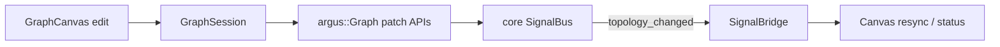

# Live topology editing (UI consumption)

**Updated**: June 2026  
**Status**: **Core done** (LT-0–LT-2 merged on argus-core `main`). **UI mostly shipped** — live topology edits + always-on executor. **Remaining:** LT-UI-4 polish (`topology_changed`, fatal Restart graph).

**Authoritative engine plan:** [argus-core `docs/internal/plan-live-topology.md`](https://github.com/yacfish/argus-core/blob/main/docs/internal/plan-live-topology.md)

**Related:** [architecture.md](architecture.md) §7, [roadmap.md](roadmap.md)

---

## 1. Goal

**Always-on executor:** the graph ticks continuously whenever a document is open. Run vs Edit is layout only — not `start()` / `stop()`.

Edit topology **while ticking** — wire nodes, add/remove nodes, hot-swap types — without `Graph::load_from_json()` and without user-visible Stop between edits. Parameter tweaks already run live via `set_parameter`. This track wires the **canvas and node panel** to core’s patch API.

**Manual restart** only after fatal engine errors (stack overflow, unrecoverable node fault, etc.) — not part of normal editing.

---

## 2. Shipped vs remaining

| Piece | Shipped | Remaining |
|-------|---------|-----------|
| Executor while document open | Always-on via `ensure_executor_running()` + `app.cpp` `poll_executor`; no public `start()`/`stop()` | Fatal **Restart graph** control |
| Interactive topology edits | Live primitives: `add_graph_node`, `connect_ports`, `remove_graph_node`, `hot_swap`, paste | Optional batch `apply_topology_patch` wrapper |
| `[EDIT]` toggle | Layout + interaction gating only; executor unchanged | — |
| Port refs on wires | `legacy_json_input_port_index` in canvas | — |
| Open bundle | Brief internal stop during `load_bundle`; auto-resume | — |
| Save bundle | No stop; `sync_editor_metadata` while ticking | — |
| Full reload paths | `apply_graph_json` (undo fallback); `new_empty_document` | — |
| Topology errors | `last_topology_error()` via session wrappers; canvas `status_` | Status bar / revision display |
| Canvas resync after patch | Manual `reconcile_topology_preserving_layout()` per edit | `topology_changed` → reactive resync (see §5) |

**Full `load_from_json` only for:** bundle replace, new empty document, undo fallback — then **auto-`start()`** immediately.

---

## 3. Core APIs (shipped)

| API | UI use |
|-----|--------|
| `apply_topology_patch(json)` | Batch canvas ops in one lock |
| `add_node` / `remove_node` | Palette add, delete selection |
| `connect_ports` / `disconnect_ports` | Wire drag / delete wire |
| `hot_swap_node` | Node panel type or params that change node implementation |
| `last_topology_error()` | Status bar + toast |
| `signals().on_topology_changed` | Bump local revision, refresh canvas |

Full document replace uses `load_bundle` / `load_from_json` under the hood, then **resumes ticking** — not a long-lived stopped graph.

---

## 4. Delivery status

### Shipped (UI)

| Area | Implementation |
|------|----------------|
| Core pin | `ARGUS_CORE_REF` includes LT APIs (`add_node`, `connect_ports`, `apply_topology_patch`, …) |
| Session patch layer | `add_graph_node`, `remove_graph_node`, `connect_ports`, `disconnect_ports`, `replace_graph_node`; `apply_editor_graph` for undo diff; `last_topology_error()` via `last_error_` |
| Canvas live ops | Palette add, wire drag, delete, hot-swap, paste/duplicate call session primitives directly — no stop between edits |
| Undo / redo | `restore_graph_state` → `apply_editor_graph`; falls back to `apply_graph_json` on failure |
| Always-on executor | `ensure_executor_running()` after doc open; `poll_executor` in `app.cpp`; dead `run_mode_panel` / `control_panel` removed; no public transport API on `GraphSession` |

| Canvas action | Core op (live) |
|---------------|----------------|
| Add node from picker | `add_graph_node` |
| Delete node / wire | `remove_graph_node` / `disconnect_ports` |
| Complete wire | `connect_ports` |
| Replace node type | `replace_graph_node` (hot-swap) |
| Paste / duplicate | `add_graph_node` + `connect_ports` |

### Remaining (LT polish)

- [ ] `SignalBridge`: subscribe to `topology_changed`; expose revision + summary — see §5
- [ ] **Restart graph** on fatal engine error
- [ ] Status bar: last patch summary or error
- [ ] Optional: `GraphSession::apply_topology_patch` batch wrapper (primitives already cover interactive edits)
- [ ] Optional: inverse patch sketch for undo (deferred)

---

## 5. `topology_changed` in SignalBridge

`topology_changed` in **SignalBridge** is the **missing subscription** — not something wired today. It is the planned UI hook for when the **engine** mutates graph topology and the canvas should react.

### Core signal

argus-core `SignalBus` emits `topology_changed` after every **successful** live topology mutation:

```cpp
struct TopologyChangedEvent {
    std::uint64_t graph_revision = 0;
    std::string   summary;   // e.g. "add_node", "connect", "patch"
};
```

Fired from `finalize_topology_mutation()` after `add_node`, `remove_node`, `connect_ports`, `disconnect_ports`, `hot_swap_node`, or `apply_topology_patch`. `graph_revision` bumps with each mutation; `summary` labels the op.

### What SignalBridge does today

`SignalBridge` (`src/signal_bridge.cpp`) is the thread-safe adapter between core signals and the ImGui thread. `GraphSession` attaches it in its constructor:

```cpp
signal_bridge_.attach(graph_.signals());
```

Today it bridges only:

| Core signal | SignalBridge storage |
|-------------|---------------------|
| `parameter_changed` | `parameter_events_` deque |
| `preview_updated` | `previews_` map |

There is **no** `bus.on_topology_changed(...)` — topology events from core are not forwarded to the UI.

### Planned wiring (LT-UI-4)

1. In `SignalBridge::attach`, subscribe to `bus.on_topology_changed`.
2. Store the latest event (revision + summary), same pattern as previews.
3. Expose `peek_topology_changed()` or `drain_topology_events()` for the UI thread.
4. `GraphCanvas` (or `app.cpp`) reads it and resyncs editor JSON from `session.export_graph_json()` when revision bumps.



### Why the app works without it

**Today:** the canvas **initiates** every topology change and keeps editor JSON in sync manually — `add_connection`, `add_palette_entry`, `delete_current_selection`, `reconcile_topology_preserving_layout`, etc. The UI already knows what changed, so the signal is not required for normal editing.

**With SignalBridge subscription:** a **reactive, engine-driven** resync path. Useful for:

- Showing revision / last op in status UI
- Topology changes the canvas did not initiate (future headless, script, or batch paths)
- One unified “bump revision → refresh canvas” instead of per-action bookkeeping
- Eventually inverse patches / multi-source undo

**Bottom line:** optional for daily editing (live primitives already work); the clean reactive layer for keeping canvas state aligned with core.

---

## 6. Implementation notes

**Executor thread:** Background `tick_once` via `graph.start()` for the lifetime of the document. No UI-thread tick loop. Core’s topology lock pauses one push pass during patch lambdas — not a user-facing Stop.

**Port indices:** Canvas already emits legacy input port indices via `node_ctl::legacy_json_input_port_index`. Keep that — core `connect_ports` resolves to internal ctl/media indices.

**Preview / controls:** After patch, core calls `on_graph_loaded` path inside `finalize_topology_mutation` — preview registry rebuilds. UI should call `refresh_preview_registry()` if needed after batch edits.

**Files (primary):**

| File | Role |
|------|------|
| `src/graph_session.cpp` | Patch wrapper vs full reload |
| `src/graph_canvas.cpp` | Diff → ops |
| `src/signal_bridge.cpp` | `topology_changed` |
| `src/app.cpp` | Live edit toggle, `poll_executor` |

---

## 7. Acceptance criteria

1. Open `demo.bundle` — graph **auto-starts** and keeps ticking.
2. Switch to Edit layout — still ticking; add `OpenCVProcessor`, connect loader → processor via patches — no `load_from_json`.
3. Hot-swap processor `blur` → `sharpen` without stopping.
4. Save bundle while ticking; open another bundle → atomic replace, back to ticking (no manual Run).
5. Bad wire shows `last_topology_error()`; fatal fault offers **Restart graph** only.

---

## 8. History (delivery order)

Original plan order — all prerequisite tracks are **merged on `main`**:

| Order | Track | Status |
|-------|-------|--------|
| 1 | **UX-A #1–#4** (shell → palette → Node tab → previews) | **Done** |
| 2 | LT-UI-0 → LT-UI-2 (core pin + session + canvas live ops) | **Done** (via primitives, not batch `apply_topology_patch`) |
| 3 | LT-UI-3 (always-on executor + layout-only `[EDIT]`) | **Done** |
| 4 | **UX-B/C** (multi-select, clipboard/duplicate/undo) | **Done** |

Active follow-up: **LT polish** only — see §4 Remaining and [roadmap.md](roadmap.md) #11.

---

*Engine tests: `argus_test_live_topology` in argus-core extended CI.*